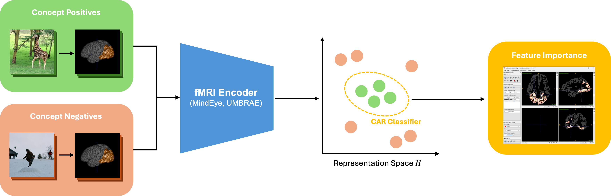
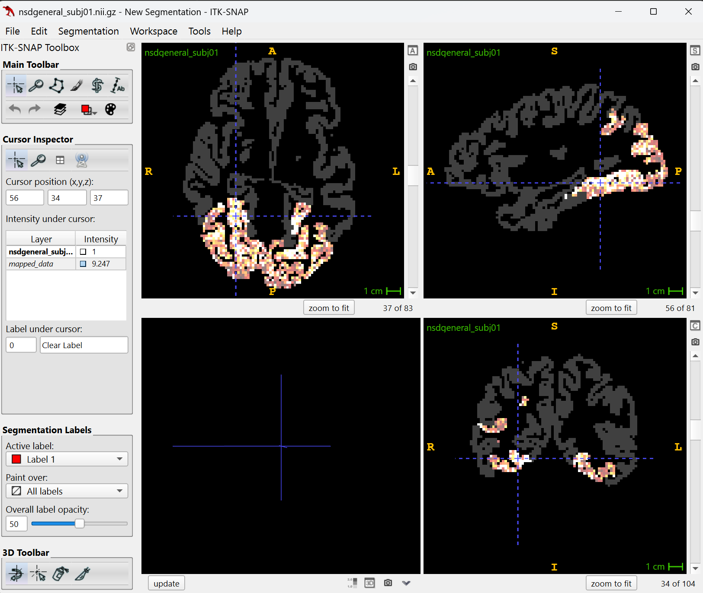

# Brain Activation Region



This repository contains the implementation of BAR, a unified concept explanation framework for brain encoders. We adapt the CAR classifier to explain human-interpretable concepts learned by these models and identify input voxels contributing to the learning. 

## 1. Setup
**Clone the repository**
```shell
git clone --recurse-submodules git@github.com:hwjustin/BAR.git
```

**Environment Setup**

```shell
conda env create -f bar_env.yml
conda activate bar
```

**Download Required Datasets and Files**

1. [NSD Dataset](https://huggingface.co/datasets/pscotti/naturalscenesdataset/tree/main): Please download the 'webdataset_avg_split' and place it in `data/webdataset_avg_split`.

2. [COCO Dataset](https://cocodataset.org/#download): Please download 2017 images and annotations and place them in `coco/images` and `coco/annotations`.

3. [NSD Stim Info](https://natural-scenes-dataset.s3.amazonaws.com/index.html#nsddata/experiments/nsd/): Please download the `nsd_stim_info_merged.csv` file and place it in `data`.

4. [NSD General Mask](https://natural-scenes-dataset.s3.amazonaws.com/index.html#nsddata/ppdata/subj01/func1pt8mm/roi/): Please download the `nsdgeneral.nii.gz` file for four subjects, rename them as `nsdgeneral_subjXX.nii.gz`and place them in `data/masks`.

**Download the pretrained MindEye and UMBRAE models**

1. [MindEye](https://huggingface.co/datasets/pscotti/naturalscenesdataset/tree/main/mindeye_models): Please download all "prior_1x768_final_subjXX_bimixco_softclip_byol" folders and place them in `train_logs_mindeye`.

2. [MindEye's Diffusion Prior](https://huggingface.co/nousr/conditioned-prior/tree/main/vit-l-14/aesthetic): Please download the pretrained checkpoint and place it in `checkpoints`.

3. [UMBRAE](https://huggingface.co/datasets/weihaox/umbrae/tree/main/train_logs): Please download 'brainx-v-1-4' and place it in `train_logs_umbrae`.


**Install 3D Medical Imaging Software**: You may download ITK-SNAP from [here](http://www.itksnap.org/pmwiki/pmwiki.php).

## 2. Concepts and Embeddings Generation

**Setup COCO API**
```shell
cd coco/PythonAPI
make
cd ../..
```

**Generate Concept Positive and Negative Voxels**
```shell
python -m experiments.concept_generation --subj 1
```

**Generate Concept Positive and Negative Embeddings**
```shell
# MindEye Model
python -m experiments.inference_mindeye --subj 1

# UMBRAE Model
python -m experiments.inference_umbrae --fmri_encoder 'brainx' --subj 1
```

## 3. CAR Classifier Fitting and Report
**Perform CAR Classifier Fitting and Report Concept Accuracies**
```shell
python -m experiments.bar --name concept_accuracy --subj 1 --model mindeye --plot
```

## 4. Voxel Attributions and Visualisation
**Generate Voxel Attributions on Concept Density Function**
```shell
python -m experiments.bar --name feature_importance --subj 1 --concept person --plot
```

**Map Voxel Attributions Back to Full Brain Coordinates**
```shell
python -m experiments.mapping --subj 1 --concept person
```

**Visualise Voxel Attributions** \
You can use ITK-SNAP to Visualise the Voxel Attribution by importing the `nsdgeneral_subjXX.nii.gz` as main image and overlaying the `mapped_data.nii.gz` file. \


## Acknowledgements

Our code is built upon:
1. Concept Activation Regions: https://github.com/JonathanCrabbe/CARs
2. MindEye: https://github.com/MedARC-AI/fMRI-reconstruction-NSD
3. UMBRAE: https://github.com/weihaox/UMBRAE?tab=readme-ov-file


We thank the authors for their great work and open-sourced code.